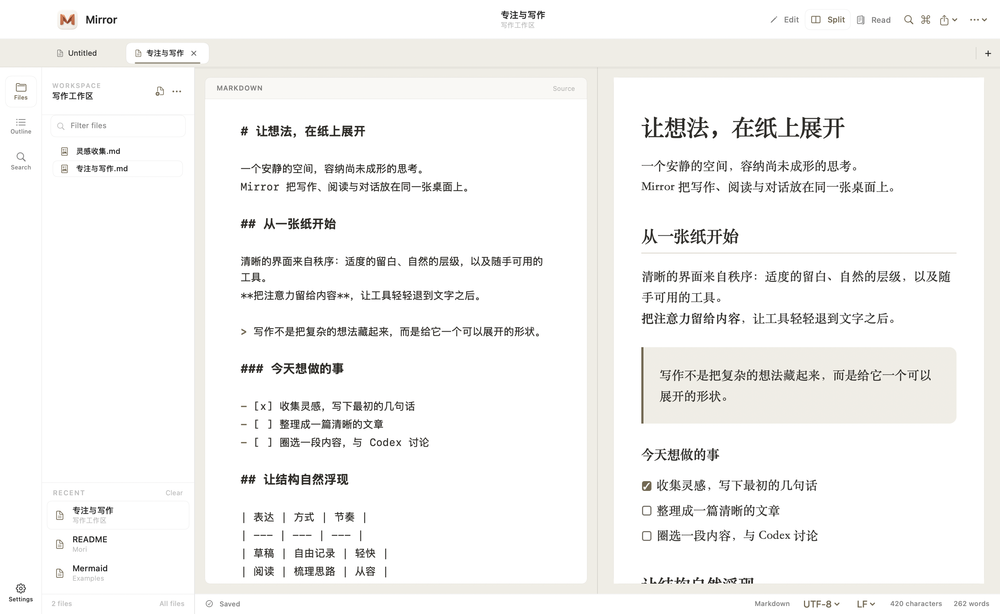
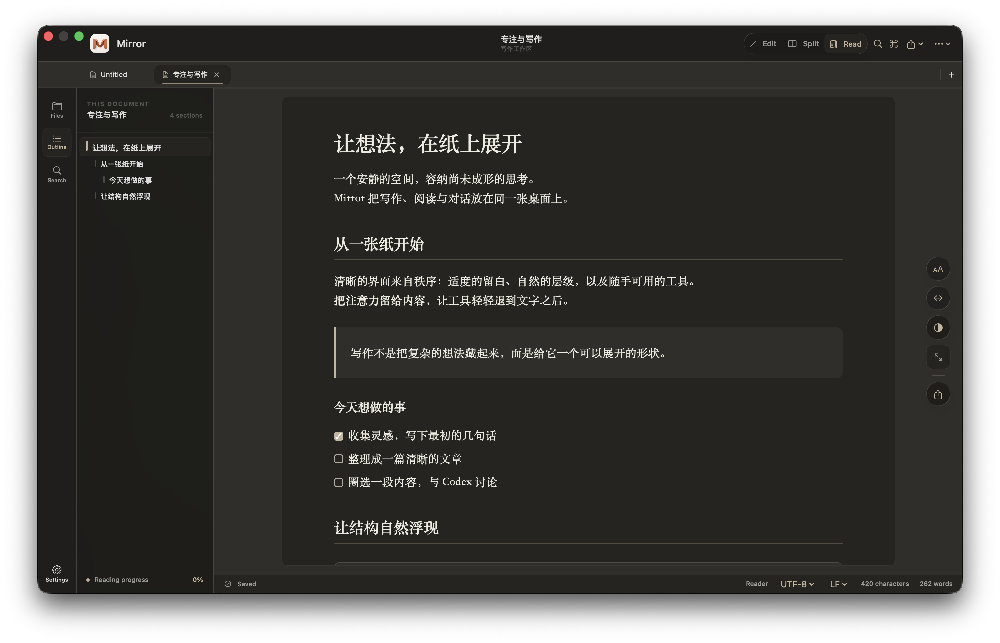

# Mirror

简体中文 | [English](README_EN.md)

Mirror 是一款原生 macOS Markdown 编辑器，专注于安静、清晰的写作体验。它将文件管理、源码编辑、实时预览与沉浸阅读整理在同一个轻量工作区中，并采用原生玻璃导航、清晰的内容区域和蓝色强调色。

[下载 Mirror 1.1](https://github.com/BoneInk/Mirror/releases/latest) · 支持 macOS 14 及更高版本

## 界面预览

### 编辑与实时预览

文件树与文档大纲可快速切换；Markdown 源码和格式化预览通过语义锚点保持双向滚动同步。



### 阅读模式

阅读模式隐藏源码噪音，提供贯穿窗口的纸张画布、章节导航、阅读进度和轻量排版工具。



### Mermaid 图表

Mermaid 图表在本地离线渲染，可以在分栏模式中一边编辑源码、一边查看结果。


## 核心功能

- 原生 Markdown 编辑器，支持语法高亮、实时预览及双向滚动同步
- 工作区文件树、最近文件、标签页、全文搜索和文档大纲
- 沉浸式阅读模式，可调整阅读宽度、字体、行高与主题
- 内置表格、代码高亮、图片、HTML、Mermaid 图表和 KaTeX 公式渲染
- 简体中文默认界面，可切换 English，并支持浅色、深色与自定义主题
- Codex 对话小窗：圈选内容携带引用，无选区右键新建对话，支持连续追问
- 自动保存、崩溃恢复、外部修改检测和本地文档历史
- 导出便携 HTML、PDF，或使用原生 macOS 打印流程

Mirror 兼容常用 CommonMark 与 GitHub 风格 Markdown，包括任务列表、脚注、表格、引用式链接、围栏代码块和安全 HTML。文本与源码文件可直接编辑，图片、PDF 和常见二进制文档可在应用内预览。

## macOS 原生外观

导航、侧边栏和浮动操作采用系统 Liquid Glass，正文使用清晰的实色背景。默认提供 `Mirror Light` 与 `Mirror Dark`，保留已有主题 ID 和自定义色板。macOS 26 使用原生玻璃效果；旧版系统使用标准材质，开启降低透明度或增强对比度时导航采用实色背景。

设计说明见 [原生样式说明](Resources/Brand/NativeStyle.md)。`./scripts/test-native-visual.sh` 在隔离工作区检查各界面。

## 引用对话气泡

- **有选区**：源码编辑区右键选择「引用并提问」，或点击阅读预览中的浮动按钮。小窗自动附上原文和文档来源，可移除引用、补充问题后发送。
- **原文关联**：引用携带源码行号（阅读预览显示所在段落的起始行），原生 Popover 气泡指向选区，采用系统材质与动画。点击「回到原文」定位并高亮实际选区，重复文本也能区分；发送后仍可回跳。开启记忆后，在已提问的位置留下对话标记，点击可回顾或继续原会话。标记通过引用内容与上下文重新定位；无法唯一匹配时隐藏，避免跳错位置。
- **无选区**：在源码区或阅读区右键选择「打开对话气泡」，开始独立对话。
- 气泡初始仅显示引用与输入框，开始对话后展开左右消息气泡；来源只显示一次。支持连续追问、流式回答、停止生成，`Return` 发送，`⌘ Return` 换行（输入法选词时回车不会发送）。Esc 或点击气泡外关闭，并清除原文临时选区；全局只显示一个对话气泡。开启记忆时，关闭气泡后尚未完成的回答会继续接收并保存。
- 点击「在 Codex 中打开」可打开对应会话；尚未发送时，打开预填问题和引用的新会话。使用当前 Codex 应用的深链接，不需要复制粘贴或 macOS 辅助功能权限。

**设置 → 气泡记忆 → 记住引用位置和对话**：默认开启，只在本机保存，不修改原文。关闭后隐藏标记并停止新增保存；已有记录保留，可重新开启或手动清除。未保存的文档不生成持久位置记忆。

需先安装并登录 Codex 桌面应用或 Codex CLI。Mirror 优先使用桌面应用内置的 Codex，通过本地 stdio App Server 复用登录，不保存登录凭据。小窗用于文档问答，以只读权限运行；需要执行操作时可转到 Codex 应用。仅在点击发送后才提交问题与引用。

接入协议：[Codex App Server](https://learn.chatgpt.com/docs/app-server)。应用深链接以当前安装版本为准。

验证选区、引用格式、会话隔离、多轮流式回复、停止与错误恢复：

```bash
bash scripts/test-codex-reference.sh
bash scripts/test-codex-bubble.sh
bash scripts/test-codex-memory.sh
# 锁屏或无前台时仅验证标记/记忆逻辑，跳过原生焦点和截图
bash scripts/test-codex-memory.sh --headless
# 可选：用当前 Codex 登录做一次真实回复测试，并输出小窗布局截图
./scripts/test-codex-reference.sh --live --visual
```

## 构建

需要 macOS 14 或更高版本，以及 Swift 6 工具链。

```bash
swift build
swift run Mirror
```

生成 Universal 2 应用和可安装 DMG：

```bash
./scripts/build-app.sh release
./scripts/build-dmg.sh --skip-build
```

构建产物位于 `dist/Mirror.app` 和 `dist/Mirror-1.1.dmg`。本地脚本使用临时签名；公开分发仍需 Apple Developer ID 签名和 Apple 公证。


### 多智能体引用提问

在 **设置 → 智能体** 中选择默认智能体、添加或编辑连接配置。气泡标题可切换智能体；已有对话切换时另起一段对话，原记录保留。旧版本的对话继续归属 Codex。

| 智能体 | 接入方式 |
| --- | --- |
| Codex | 原有 app-server；自动发现桌面应用 / CLI，可指定命令路径和模型 |
| Claude Code | 本机 `claude` 的非交互 JSON 输出；复用 CLI 登录 |
| OpenCode | 本机 `opencode run --format json`；复用 CLI 配置 |
| Pi Agent | 本机 `pi --print --mode json`；复用 CLI 配置 |
| OpenClaw | Gateway 的 OpenAI 兼容接口，默认基础地址 `http://127.0.0.1:18789/v1`、智能体 `openclaw/default` |
| CodeBuddy | `codebuddy` / `cbc` 非交互 JSON 输出；不会将 IDE 启动器 `buddycn` 当作 Agent |
| Cursor | `cursor-agent` / `agent` 的 Ask 模式；需要安装 Cursor CLI，桌面应用本身不等于 CLI |
| Kimi | `kimi --quiet --plan`，复用 CLI 登录 |
| Qoder | `qoder` / `qodercli` 非交互文本输出 |
| Hermes | 官方 Agent API Server，默认 `http://127.0.0.1:8642/v1`，标识 `hermes-agent`；需启用 API Server 并配置 Key |
| Smartwork | D-Chat 内置 Agent 原生协议，默认 `http://127.0.0.1:8764`；复用客户端模型和登录 |
| WorkBuddy | 官方本地助理 Open API；需填入具有 localassistant.readable / invokable 权限的 Access Token，并保持电脑端在线 |
| 千问办公 | 可配置办公 Agent 包装命令 / 兼容服务；尚未确认公开的问答协议，不等同于普通千问模型接口 |
| DeepSeek Harness / 自定义 | 配置兼容 HTTP 服务，或通过自定义命令包装专有协议 |

打开设置自动检测常见命令路径（包括 Homebrew、NVM、用户 bin），并列出当前用户可见的本机监听端口。端口列表仅用于定位服务，不推断它是哪个智能体，也不发送测试提问；已配置的 localhost HTTP 服务仅以匿名 `GET /models` 检查响应。Smartwork 另外匿名检查 `/api/agent/health` 的名称与协议标识，本机服务已验证；未知服务需手动填写地址与协议。扫描不会读取认证信息或发起模型调用。

HTTP 配置使用包含 `/v1` 的基础地址、模型/智能体标识，以及可选的 API Key / Bearer Token。认证信息存于 macOS 钥匙串，不写入对话记录。OpenClaw 需要先启用 Gateway 的 `chatCompletions` 端点。远端工具权限由服务端控制。

自定义命令的参数为 JSON 字符串数组，例如 `["--print"]`。Mirror 直接启动可执行文件，不经过 shell；stdin 传入阅读助手说明和 JSON 编码的完整对话，stdout 返回 UTF-8 回答，stderr 用于命令自身诊断。每轮重新启动，包装脚本负责对接专有协议、认证与退出信号。不要把密钥放入参数。

Codex 沿用服务端会话；其他连接每轮携带 Mirror 保存的对话上下文，避免借用 CLI 的“最近会话”。配置快照保存在对应的气泡记忆中，之后修改默认服务不会改变旧记录的去向。Claude / CodeBuddy / Qoder / Pi 禁用内置工具，OpenCode 使用专用阅读配置禁止工具，Cursor 使用 Ask 模式、Kimi 使用 Plan 模式；这些 CLI 选项需要较新版本。未安装或版本不支持时，气泡显示错误并保留问题供重试。

验证：`bash scripts/test-agents.sh` 使用本地假 CLI 与 HTTP 服务覆盖流式输出、Unicode、多轮、取消、错误、重定向阻止、配置持久化和历史归属；不会调用真实模型。

协议依据：[Claude Code](https://code.claude.com/docs/en/headless)、[OpenCode CLI](https://opencode.ai/docs/cli/)、[Pi JSON](https://github.com/badlogic/pi-mono/blob/main/packages/coding-agent/docs/json.md)、[OpenClaw Gateway](https://docs.openclaw.ai/gateway/openai-http-api)。新增协议依据：[CodeBuddy](https://www.codebuddy.ai/docs/cli/cli-reference)、[Cursor](https://prod.cursor.com/docs/cli/using)、[Kimi](https://moonshotai.github.io/kimi-cli/en/reference/kimi-command.html)、[Qoder](https://docs.qoder.com/cli/cli-reference)、[Hermes Agent API](https://hermes-agent.nousresearch.com/docs/user-guide/features/api-server)、[WorkBuddy Open API](https://open.workbuddy.cn/docs/openapi)。Smartwork 对照本机客户端打包的 `smartwork-agent-turns-v1` 实现，并完成匿名健康检查；其余新接口通过模拟服务验证，未发送真实模型问题。

WorkBuddy 使用共享的本地助理消息通道，返回本次消息后的首条文字回复；请避免同时从其他入口向它提问。Mirror 检测到其他用户消息时停止归属这次回复，权限确认需在 WorkBuddy 中处理。停止等待或删除本机记录不会终止 WorkBuddy 中已接收的任务。Access Token 到期后需要重新授权并更新；Mirror 不内置第三方应用的 OAuth 客户端密钥。

千问办公公开开发文档目前展示管理接口，故预设标为待配置；只有接好办公 Agent 桥接后才能使用。不会将 `qwen` 模型 CLI 或阿里云普通模型 API 自动认作千问办公。


### v1.1 交互更新

- 划词提问入口跟随鼠标选区的结束端；支持反向拖选、跨行选区和窗口边缘避让。
- 气泡输入框按 `Return` 发送，`⌘ Return` 插入换行。中文输入法组合文本期间，回车先交给输入法，不发送问题。
- 气泡详情右上角的垃圾桶按钮和右键菜单可删除当前本机记录；原文旁的气泡标记也支持右键删除。同一位置多条记录可单独删除或全部删除。**设置 → 气泡记忆** 支持搜索、单条删除、批量编辑选择、全选当前结果和批量删除。
- 删除立即移除原文标记，停止对应的后台生成保存，避免记录重新出现；其他记录不受影响。删除只作用于 Mirror 本机记忆，不删除智能体服务端会话。

- 系统文件目录授权弹窗、文件选择面板和临时失焦不关闭气泡或清空输入；主动点击外部与 Esc 仍可关闭。
