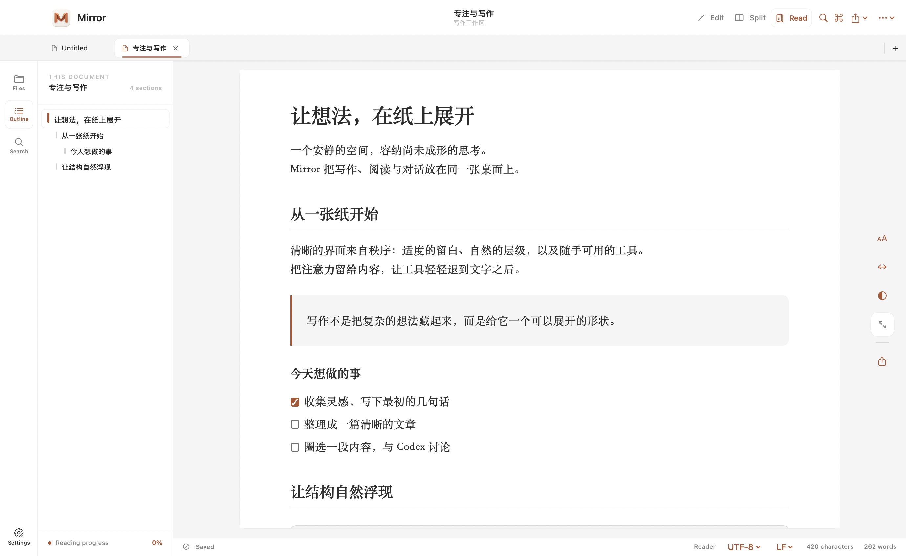

# Mirror

简体中文 | [English](README_EN.md)

原生 macOS Markdown 编辑器，把写作、阅读和围绕原文的 AI 讨论放在同一个工作区。

[下载 Mirror 1.1](https://github.com/BoneInk/Mirror/releases/tag/v1.1) · macOS 14+ · Intel / Apple Silicon

## Mirror 的重点

- **讨论留在原文旁。** 划词即可打开对话气泡，问题与引用位置关联。下次读到这里，可以点开标记回顾或继续提问；记录支持单独、批量删除。
- **使用自己的智能体。** 可连接 Codex、Claude Code、Smartwork 等本机运行时或服务。在气泡里切换智能体、模型与支持的思考深度，自动记住选择；也支持自定义接入。
- **写作与阅读连在一起。** 源码与预览双向同步滚动，一键进入阅读模式；文件树、大纲和本地文档历史随时可用。
- **文档保留在本地。** 直接编辑 Markdown 文件，Mermaid 图表与数学公式离线渲染，可导出 HTML / PDF。只有发送提问时，问题与引用才会交给所选智能体。

## 界面




## 开始使用

下载安装包，将 Mirror 拖入 Applications。选中文字后点击「提问」；`Return` 发送，`⌘ Return` 换行，`Esc` 关闭气泡。

在设置中配置智能体和气泡记忆。不同运行时需要各自的安装、登录或服务配置；WorkBuddy 需要授权 Token，千问办公目前通过自定义桥接接入。详见[智能体接入说明](docs/agents.md)。

安装包使用 ad-hoc 签名，尚未完成 Apple 公证。

首次打开若提示“Apple 无法验证 Mirror”，请先点“完成”，再到 **系统设置 → 隐私与安全性 → 仍要打开**，按提示确认。仅在确认安装包来自本项目 Release 且信任来源时操作。详见 [Apple 官方说明](https://support.apple.com/zh-cn/102445)。

## 从源码构建

需要 Swift 6 工具链：

```bash
swift run Mirror
# 生成通用应用与安装包
bash scripts/build-app.sh release
bash scripts/build-dmg.sh --skip-build
```

产物位于 `dist/`。回归检查见 `scripts/test-*.sh`。
