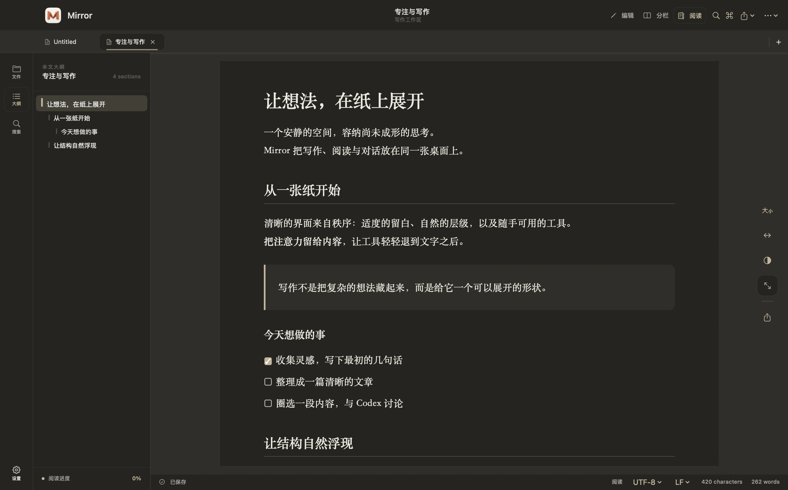

# Mirror

简体中文 | [English](README_EN.md)

## Mirro是什么？
一款以简洁、轻快、美观为核心目标的Markdown编辑器，顺便支持一些Agent相关的小功能。

| 平台 | 当前版本 | 下载 | 系统要求 |
| --- | --- | --- | --- |
| macOS | 1.3.6 | [DMG 与更新说明](https://github.com/BoneInk/Mirror/releases/tag/v1.3.6) | macOS 14+ · Intel / Apple Silicon |
| Windows | 1.3.6 | [安装版](https://github.com/BoneInk/Mirror/releases/download/v1.3.6/Mirror-1.3.6-windows-x64-setup.exe) · [便携版](https://github.com/BoneInk/Mirror/releases/download/v1.3.6/Mirror-1.3.6-windows-x64-portable.exe) · [更新说明](https://github.com/BoneInk/Mirror/releases/tag/v1.3.6) | Windows 10 / 11 · x64 |

## 为什么做Mirro
本人在工作中，经常需要阅读各种Markdown文档，特别是AI Coding之后，与各类Agent的交互和成果核对，更多依赖于阶段性的Markdown文档产出，因此对于一款好用的本地Markdown编辑器的需求更显得急迫。

它可以没有各类云端功能，没有各种花哨的交互，没有独特的设计语言，但对于基础的Markdown操作必须友好。在此基础上，再增加一些AI场景下常用到的功能点。

## 软件特点

- **功能简单但不简陋**：目前主流的开源Markdown编辑器都有着功能性上过度简洁或者过度设计的特点，有些甚至有很多兼容性问题，做好一款本地化的markdown编辑器反而显得难得。
- **UI简洁美观**：风格上追求拟纸质感的阅读体验，无论是编辑、预览、导出，界面UI设计都非常舒适易用，常用功能都在手边，随时根据个人喜好切换。
- **Agent支持**：圈选文档语句，直接向本机已安装的agent提问，或者引用到已有会话中，尽可能减少阅读时的跳出，打断心流体验。

## 界面

**macOS · 分栏编辑与实时预览**


**macOS · 沉浸式阅读**


**macOS · 深色阅读**



**Windows · 分栏编辑与实时预览**


## 开始使用

- **macOS：** 下载 DMG，将 Mirror 拖入 Applications。
- **Windows：** 运行安装版 `.exe`，或直接打开便携版。文件校验见 [SHA256SUMS.txt](https://github.com/BoneInk/Mirror/releases/download/v1.3.6/SHA256SUMS.txt)。

### 自动更新

macOS 与 Windows 默认每天检查 GitHub Releases；API 限流时读取 Release 中的更新清单，后台下载并验证 SHA-256，正常退出后安装，下次打开即为新版。更新不会打断写作，也可以在设置中关闭自动更新、手动检查或立即重启更新；重启前会保留草稿。macOS 在“软件更新”设置页，Windows 在“关于 Mirror”中操作。首次升级到支持此功能的 v1.3.6 仍需手动安装；无写入权限的安装目录会保留已下载的安装包，供手动安装。

### 圈选提问操作方式：
打开 Markdown，选中文字后点击「提问」。提示会出现在选区末端附近，对话在引用旁打开。`Enter/Return` 发送，macOS 用 `⌘ Return` 换行，Windows 用 `Ctrl Enter` 换行，`Esc` 收起对话。

macOS 的预览或阅读模式中，Mermaid 流程图支持直接拖动外框的右边、下边或右下角调整宽高；靠近边缘时光标会提示拖拽方向，不显示额外手柄或边条，图表自动适配外框，也可按住图表拖拽移动；使用右上角的加减按钮、`⌘/Ctrl + 滚轮` 或触控板捏合缩放。双击图表或点击复位按钮可重新适配；图表获得焦点后也可用方向键移动、加减键缩放、`0` 复位，拖拽时按 `Esc` 取消。操作只影响预览，不会修改 Markdown 或导出的图表。图片不再提供拖拽缩放，旧版保存的尺寸注释也不再生效。

要引用到已有 Codex 会话，macOS 中选中文字后右键选择「引用到 Codex 会话…」；Windows 中先点击「提问」，再展开对话顶部的智能体菜单，选择「引用到 Codex 会话…」。预览历史并选定目标，退出 Codex 桌面后即可在 Mirror 继续原会话。macOS 还支持「在 Codex 打开」填入桌面草稿（会替换原草稿）。详见[会话引用说明](docs/codex-thread-reference.md)和 [Windows 使用说明](Windows/README.md)。

在设置中配置智能体和气泡记忆。不同运行时需要各自的安装、登录或服务配置；WorkBuddy 需要授权 Token，千问办公目前通过自定义桥接接入。详见[智能体接入说明](docs/agents.md)。

### 安装包签名注意
macOS 安装包使用 ad-hoc 签名，尚未完成 Apple 公证；Windows 安装包未签名。

首次打开若提示“Apple 无法验证 Mirror”，请先点“完成”，再到 **系统设置 → 隐私与安全性 → 仍要打开**，按提示确认。仅在确认安装包来自本项目 Release 且信任来源时操作。详见 [Apple 官方说明](https://support.apple.com/zh-cn/102445)。


### 发布更新元数据

上传两端安装包前，使用相同文件生成校验和与备用更新清单，并将输出一起上传到正式 Release：

```bash
python3 scripts/create-update-manifest.py --tag v1.3.6 \
  dist/Mirror-1.3.6.dmg \
  Windows/release/Mirror-1.3.6-windows-x64-setup.exe \
  Windows/release/Mirror-1.3.6-windows-x64-portable.exe
# 上传 dist/Mirror-update.json 和 dist/SHA256SUMS.txt
```
