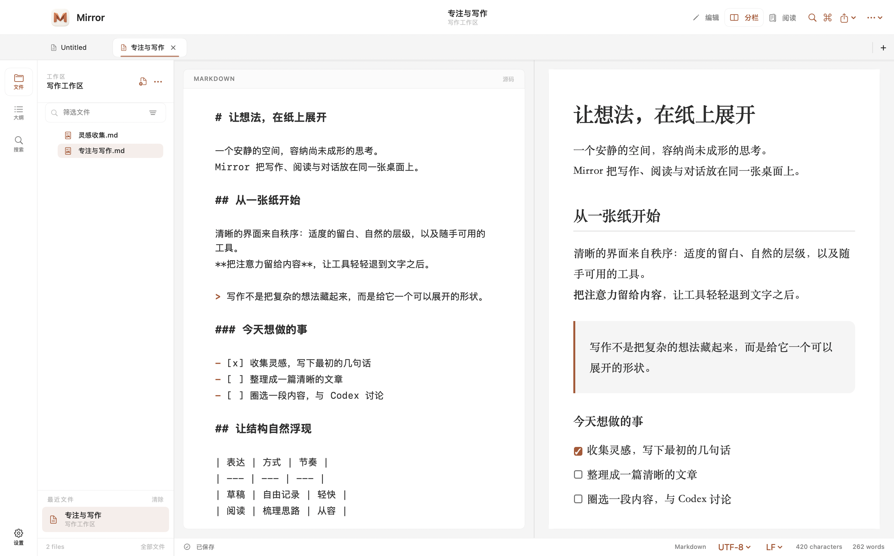
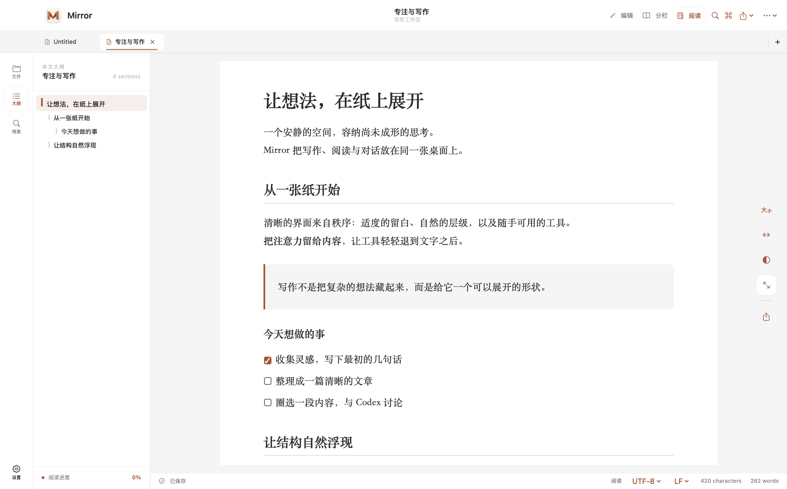
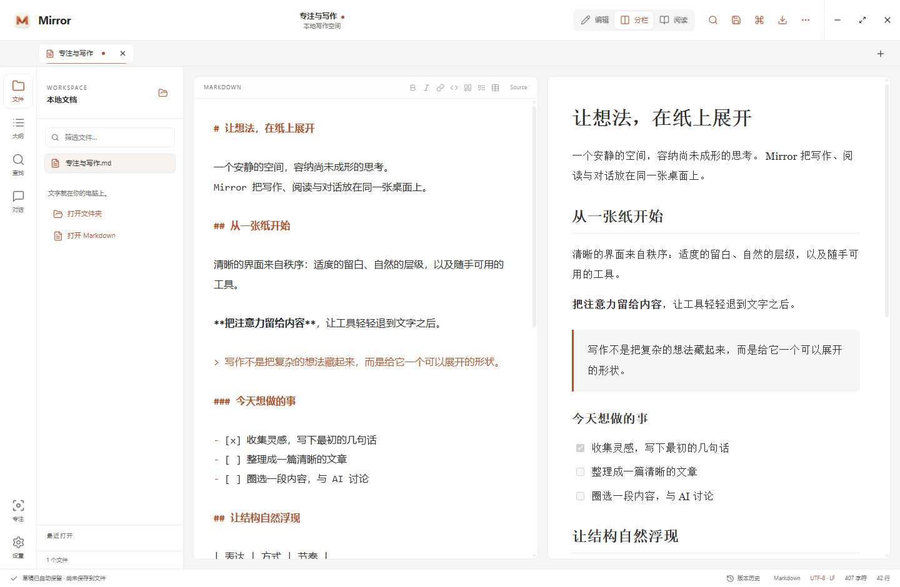

# Mirror

[简体中文](README.md) | English

## What is Mirror?

A Markdown editor focused on simplicity, speed, and a pleasant interface, with a few handy features for working with agents.

| Platform | Current version | Download | Requirements |
| --- | --- | --- | --- |
| macOS | 1.3.0 | [DMG and release notes](https://github.com/BoneInk/Mirror/releases/tag/v1.3.0) | macOS 14+ · Intel / Apple Silicon |
| Windows | 1.3.2 | [Installer](https://github.com/BoneInk/Mirror/releases/download/v1.3.2/Mirror-1.3.2-windows-x64-setup.exe) · [Portable](https://github.com/BoneInk/Mirror/releases/download/v1.3.2/Mirror-1.3.2-windows-x64-portable.exe) · [Release notes](https://github.com/BoneInk/Mirror/releases/tag/v1.3.2) | Windows 10 / 11 · x64 |

## Why I built Mirror

I often read Markdown documents at work. With AI coding, interacting with agents and reviewing their output increasingly depends on Markdown documents produced at each stage. That makes a good local Markdown editor even more important to me.

Cloud features, elaborate interactions, and a distinctive design language are optional. The basic Markdown experience needs to be easy to use. On top of that, I want a few features that are useful when working with AI.

## Features

- **Simple, without feeling bare:** Mainstream open-source Markdown editors tend to be either too limited or overloaded, and some have plenty of compatibility issues. A good local Markdown editor is surprisingly hard to find.
- **A clean, pleasant interface:** The design aims to make reading feel like reading on paper. Editing, previewing, and exporting should all be comfortable, with common tools close at hand and options you can adjust to your preferences.
- **Agent support:** Select a passage to ask an agent installed on your computer, or quote it into an existing conversation. The goal is to reduce switching between apps and keep your reading flow uninterrupted.

## Screenshots

## Get started

- **macOS:** Download the DMG and drag Mirror into Applications.
- **Windows:** Run the installer `.exe`, or open the portable edition directly. Checksums are in [SHA256SUMS.txt](https://github.com/BoneInk/Mirror/releases/download/v1.3.2/SHA256SUMS.txt).

### Asking about selected text

Open a Markdown file, select text, and click Ask. The prompt appears near the selection's focus end, and the conversation opens beside the quoted passage. `Enter/Return` sends, `⌘ Return` on macOS or `Ctrl Enter` on Windows inserts a newline, and `Esc` closes the bubble.

On macOS, in preview or reading mode, drag the right border, bottom border, or bottom-right corner to resize the Mermaid frame. The cursor changes near the edge, with no extra grips or edge strips. The diagram automatically fits the frame; drag the diagram itself to pan. Zoom with the header buttons, `⌘/Ctrl + wheel`, or a trackpad pinch. Double-click or use the reset button to fit the diagram again. When focused, use arrow keys to pan, plus/minus to zoom, `0` to reset, or `Esc` to cancel a drag. These interactions only affect the preview; Markdown and exported diagrams keep their original layout. Image resize handles have been removed, and size comments saved by older versions are ignored.

To quote text into an existing Codex thread, select text on macOS, right-click, and choose “Quote to Codex thread…”. On Windows, click Ask, open the agent menu at the top of the conversation, and choose “Quote to Codex thread…”. Preview the history and select a thread, then close Codex desktop before continuing in Mirror. On macOS, “Open in Codex” can also fill the desktop draft, replacing its existing contents. See the [thread reference guide (Chinese)](docs/codex-thread-reference.md) and [Windows guide (Chinese)](Windows/README.md).

Configure agents and conversation memory in Settings. Each runtime requires its own installation, login, or service configuration. WorkBuddy requires an authorized token; QwenWork currently requires a custom bridge. See the [agent setup guide (Chinese)](docs/agents.md).

### Package signing

The macOS app is ad-hoc signed and has not been notarized by Apple. Windows packages are unsigned.

If macOS says “Apple cannot verify Mirror” when you first open it, click Done, then go to **System Settings → Privacy & Security → Open Anyway** and confirm. Only proceed if the package came from this project’s Release page and you trust the source. See [Apple’s instructions](https://support.apple.com/en-us/102445).
