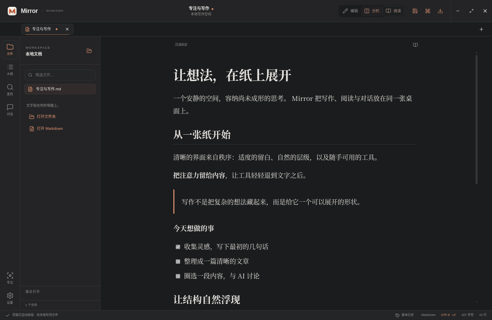

# Mirror for Windows · 0.1.0

基于原版 Mirror 的功能与视觉实现的独立 Windows 桌面项目。保留原版折页 M 图标、暖橙色强调色、导航与正文分层、细分隔线和宽松留白；窗口控制与键盘操作适配 Windows。原 macOS Swift 项目可继续独立构建。

技术栈：Electron 38、React 19、Vite 7。支持 Windows 10 / 11，x64；提供 ARM64 构建命令。

## 界面





## 已实现

- 本地 Markdown / 纯文本打开、文件夹递归浏览、文件筛选、最近文件和多标签。
- 编辑、实时分栏、沉浸阅读、专注模式；大纲定位、文内查找、按滚动比例同步预览。
- GFM 表格与待办、代码高亮、KaTeX 公式、Mermaid 图表；运行时使用打包资源，离线渲染。
- 相对路径本地图片（限文档目录内 PNG/JPEG/GIF/WebP/AVIF/BMP）。远程图片不自动请求。
- 格式工具栏、粗体/斜体/链接快捷键、原生文本撤销、字符与行数统计。
- 自动保留未保存草稿，重启恢复标签与视图；手动保存文件、另存为、外部修改冲突提示。
- 保存版本历史（每份文档最近 30 个快照），恢复到编辑器后再检查保存。
- 编辑器和预览选区提问、多轮对话、回复流式显示与停止、引用位置、文档关联的对话记录。
- Codex CLI、Claude Code CLI、OpenAI 兼容 HTTP、自定义 stdin/stdout 命令。
- 浅色、深色、跟随系统主题，字号设置，命令面板。
- HTML / A4 PDF 导出：内嵌图表、公式字体、允许的本地图片。
- Windows 窗口控制、`.md` 文件关联、单实例打开、NSIS 安装版和便携版配置。

## 运行与打包

安装 Node.js 22 LTS 与 npm。在 Windows PowerShell 中：

```powershell
cd Windows
npm ci
npm run dev
```

运行生产版本或生成安装包：

```powershell
npm run build
npm start
npm run dist:win
# Windows ARM64：
npm run dist:win:arm64
```

`release/` 输出 NSIS 安装版与便携版 `.exe`。安装版支持选择安装目录、桌面快捷方式和 `.md` 关联。没有代码签名证书时产物未签名；发布版本应配置 electron-builder 支持的证书与签名环境变量。

仓库的 [Windows desktop 工作流](../.github/workflows/windows.yml) 在 Windows 上运行检查并生成安装包；也可以手动触发。不自动发布 Release。

## 智能体配置

设置 → 智能体 → 选择连接 → 填写配置 → 保存并设为默认。对话保留创建时的配置快照，修改默认配置后重新选区开启新对话。

| 连接 | 要求与行为 |
| --- | --- |
| Codex | 本机已安装并登录 `codex`；使用 `codex exec --sandbox read-only --ephemeral --json`。每轮独立执行，携带 Mirror 保存的完整对话；可配置模型与思考深度。 |
| Claude Code | 本机已安装并登录 `claude`；使用 `--print --output-format text --tools ""`，可配置模型。 |
| 兼容 HTTP | 基础地址包含 `/v1`，必须配置模型 ID；支持 `/chat/completions` SSE 或普通 JSON 回复。拒绝重定向。可接入支持此协议的 OpenClaw、Hermes 或自建桥接。 |
| 自定义命令 | 可执行文件的绝对路径或 PATH 命令；参数为 JSON 字符串数组。stdin 接收 `{system, reference, messages}`，stdout 返回 UTF-8 文字；不经过 shell。 |

Windows 自动查找 PATH 和 `%APPDATA%\npm` 中的命令。支持标准 npm `.cmd` shim，通过对应 JavaScript 入口运行；其他 `.cmd` / `.bat` 需要改用 `.exe` 或 `.js` 包装脚本。CLI 需要较新版本，不支持参数时界面显示错误并保留问题。停止会中止 HTTP 请求或直接启动的 CLI 进程；自定义程序派生的进程需要由包装程序处理退出。

HTTP 密钥由 Electron `safeStorage` 使用 Windows DPAPI 加密，保存在本机应用数据目录；不返回到网页、不写入对话记录。登录状态由各 CLI 管理。只有主动发送提问时才传递引用资料与当前对话，不发送整篇文档。Codex 与自定义进程具有其运行时自身的访问范围，Mirror 的选区发送范围不等于进程权限隔离。

## 本机数据与快捷键

数据位于 Electron 的 `app.getPath('userData')`（默认 `%APPDATA%\mirror-windows`）：`session.json` 草稿、`settings.json` 设置、`conversations.json` 对话、`history/` 保存快照、`credentials.json` 加密凭据。文档仍位于用户选择的原路径。草稿、历史和对话未加密，不自动同步；保存或恢复不会让 AI 修改文档。

| 快捷键 | 操作 |
| --- | --- |
| Ctrl N / Ctrl O | 新建 / 打开文件 |
| Ctrl Shift O | 打开文件夹 |
| Ctrl S / Ctrl Shift S | 保存 / 另存为 |
| Ctrl 1 / 2 / 3 | 编辑 / 分栏 / 阅读 |
| Ctrl B / I / K | 粗体 / 斜体 / 链接 |
| Ctrl P | 命令面板 |
| Ctrl Z / Ctrl Y | 文本撤销 / 重做 |
| Enter / Ctrl Enter | 提问发送 / 换行（Shift Enter 也可换行） |
| Esc | 收起浮层、对话或退出专注 |

## 验证与首版边界

```powershell
npm test
npm run build
npm run test:ui
```

`npm test` 使用临时文件、假 CLI 与本机 HTTP 服务，不调用真实模型。桌面测试使用独立应用数据目录，覆盖渲染、主题与模式恢复、草稿、文件保存、冲突、历史、HTML/PDF 导出和选区对话。Linux 验证需要 Xvfb：`DISPLAY=:99 npm run test:ui`。

这不是 macOS 1.3.0 的完整功能对齐版。尚未移植已有 Codex 会话列表与续聊、Smartwork/WorkBuddy 专有协议、自动模型发现、工作区全文搜索、文件监听与冲突横幅、文件拖放、多套自定义主题和原版精确行位置滚动同步。工作区最多扫描 6 层 / 2000 个文档，单个文本文件上限 10 MB；文件夹内的符号链接不递归浏览。

真实智能体登录/模型兼容性、Windows DPAPI、文件关联、安装/卸载、ARM64 和系统缩放应在目标 Windows 机器上验收。构建通过和 Linux Electron 回归不替代这些检查。

详细测试结果与交叉构建边界见 [验证记录](docs/validation.md)。本次已生成未签名的 x64 便携版；安装版配置已提供，当前 Linux 环境未能完成 NSIS 构建。
