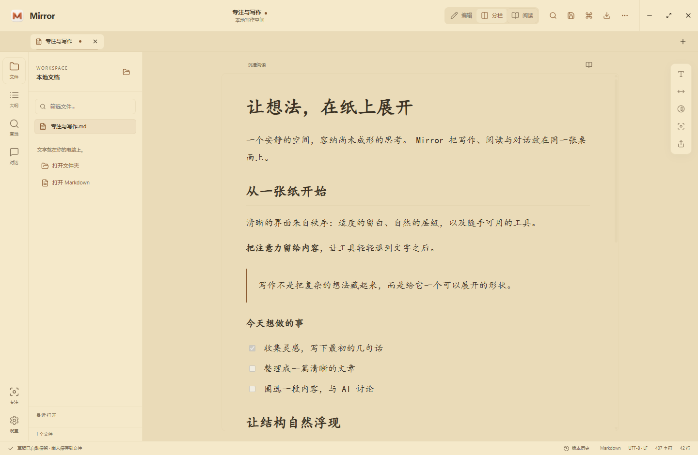
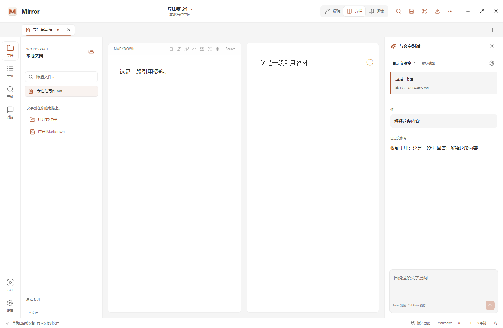
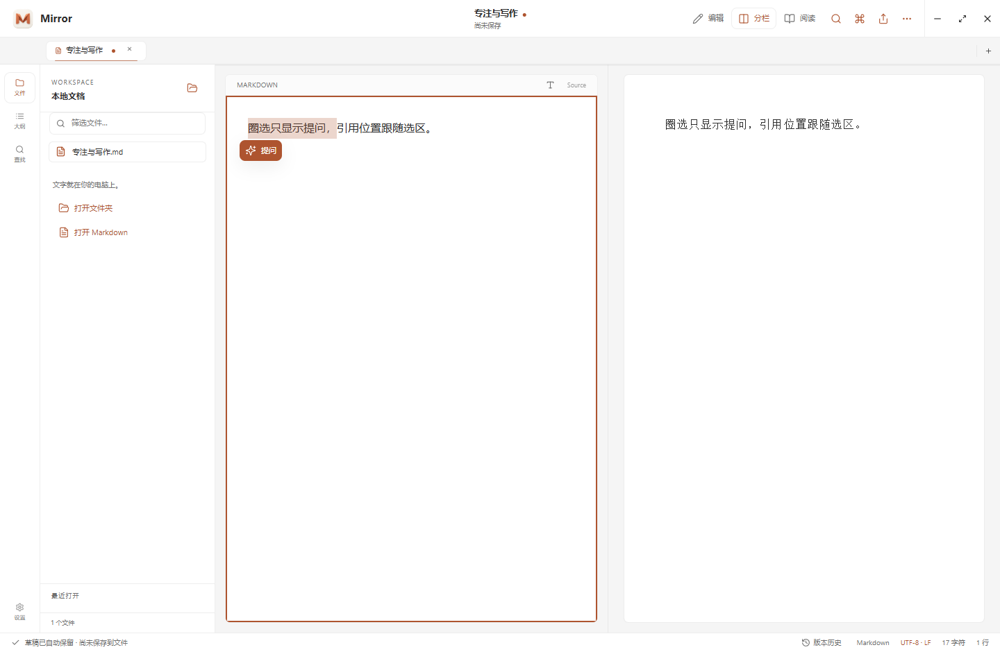

# Mirror for Windows · 1.3.6

[安装版](https://github.com/BoneInk/Mirror/releases/download/v1.3.6/Mirror-1.3.6-windows-x64-setup.exe) · [便携版](https://github.com/BoneInk/Mirror/releases/download/v1.3.6/Mirror-1.3.6-windows-x64-portable.exe) · [更新说明](https://github.com/BoneInk/Mirror/releases/tag/v1.3.6) · [SHA-256 校验](https://github.com/BoneInk/Mirror/releases/download/v1.3.6/SHA256SUMS.txt)

支持 Windows 10 / 11 x64。Windows 项目使用 Electron 44、React 19 和 Vite 7，按 macOS 源码对齐主要界面与交互。保留折页 M 图标、纸张画布、暖色强调、标签导航和阅读留白，窗口控制与快捷键适配 Windows。

## 开始使用

运行安装版 `.exe`，或直接打开便携版。在「设置 → 智能体」配置已安装的 CLI 或服务连接，再打开 Markdown，圈选内容并点击「提问」。`Enter` 发送，`Ctrl Enter` 或 `Shift Enter` 换行，`Esc` 收起对话。

圈选提示只显示「提问」，位于选区末端附近；松开后移动鼠标不会改变位置，滚动或调整窗口时自动重新定位。要继续已有 Codex 会话，展开对话顶部的智能体菜单，选择「引用到 Codex 会话…」，预览历史后点击「在 Mirror 继续原会话」。续聊前需退出 Codex 桌面。

## 自动更新

默认每天检查 GitHub Releases，后台下载并校验 SHA-256。安装版静默更新，便携版替换原 EXE；都在正常退出后安装，下次打开即为新版。安装失败时恢复备份文件。首次升级到 v1.3.6 需手动安装，此后的版本可自动更新。

在「设置 → 关于 Mirror」可关闭自动更新、手动检查或立即重启更新；立即重启会先保留草稿与会话。安装目录不可写时可打开下载好的安装包手动更新。

## 界面








## 功能

- 本地 Markdown / 纯文本、文件夹浏览、筛选、最近文件、多标签与文件拖放。
- 文内与工作区全文搜索、大纲定位、相对文档链接与标题跳转。
- 编辑、分栏、阅读、专注；源码高亮、格式工具、括号补全、缩进、换行、拼写与打字机选项。
- 按源代码行和渲染块同步滚动，支持智能、顶部、居中与关闭。
- GFM、代码高亮、KaTeX、Mermaid、元数据、提示块与单行脚注，全部离线渲染。
- Mermaid 缩放、拖动、适配与外框宽高调整；交互只影响预览，原文和导出不受影响。
- 九套 macOS 主题、跟随系统、自定义配色；写作/阅读/代码字体、字号、行距、宽度与悬浮工具。
- 按当前 macOS 源码统一工具栏、标签、导航、纸张留白、阅读工具、搜索/版本历史与设置分区；侧栏和分栏支持拖动调整，对话使用浮动气泡。
- 圈选后只显示“提问”，按选区末端定位，支持反向选择、键盘选择和编辑器自动换行；引用对话锚定到选区或记忆标记，滚动和窗口调整时重新定位，靠近边缘自动避让。引用到 Codex 已有会话的入口在对话的智能体菜单中。
- 行号、当前行高亮、预览/导出保留单行换行；气泡记忆开关、搜索与删除管理。
- 草稿恢复、文件监听；干净文档自动载入外部修改，未保存文档保留草稿并显示冲突横幅；保存时再次核对磁盘版本。
- 最近 30 个保存快照、HTML / A4 PDF 导出，内嵌图表、公式字体与本地图片。
- 选区提问、流式回复、停止、历史与引用标记；会话保留配置快照，切换智能体、模型或思考深度时保留旧对话。
- Codex 已有会话列表、分页、历史预览与原会话续聊；发送后或连接中断需刷新历史再继续，避免重复发送。
- 智能体检测、模型列表与手动 ID、配置添加/复制/删除；确认缺失的本地 CLI 自动从对话列表隐藏，设置保留配置入口，安装后重新检测即可恢复。HTTP 服务暂时离线不会被当作未安装，旧配置和历史对话继续保留。
- Windows 窗口控制、单实例、NSIS 安装包与便携包，安装包提供 `.md` 关联。

## 构建与检查

安装 Node.js 22.12+ 与 npm：

```powershell
cd Windows
npm ci
npm run dev
# 生产构建与验收
npm run build
npm test
npm run test:ui
# x64 安装版与便携版
npm run dist:win
npm run test:updates-install # 在 Windows 上验证实际安装包的更新与回退
# 可选 ARM64 构建（本次未验收）
npm run dist:win:arm64
```

`release/` 输出安装版和便携版 `.exe`。本次 Release 是未签名的 x64 构建；签名发布需配置 electron-builder 的证书环境变量。[Windows 工作流](../.github/workflows/windows.yml) 在 Windows 上运行检查并构建产物。

## 智能体

在「设置 → 智能体」配置连接，保存并设为默认。对话内也可切换智能体、模型与支持的思考深度。只有发送提问时才传递选区资料与对话上下文。

| 智能体 | 连接方式 |
| --- | --- |
| Codex | 已安装并登录的 `codex`。新对话使用只读、临时 `exec`；已有会话使用 app-server 的 list/read/resume/turn 协议。 |
| Claude Code / CodeBuddy | 原生流式 CLI，提取助手文字，关闭工具与会话持久化。 |
| Cursor / Kimi / Qoder | 原生 CLI 的 ask / plan / 无工具文字模式。 |
| OpenCode / Pi Agent | 原生 JSON 事件协议，屏蔽工具或扩展；忽略推理与工具事件。 |
| Smartwork | `/api/agent/turns`、模型与健康检查协议，复用客户端登录。 |
| WorkBuddy | 开放平台 `localassistant` 协议，需 Access Token 与在线电脑端；同账号一次等待一个提问。 |
| Hermes / OpenClaw / DeepSeek Harness / HTTP | 兼容 `/chat/completions` 的 SSE / JSON 服务，可读取 `/models`，须填写有效模型 ID。 |
| 千问办公 / 自定义命令 | 包装命令；stdin 接收 `{system, reference, messages}` JSON，stdout 返回 UTF-8 文字，不经过 shell。 |

Windows 查找 PATH、`%APPDATA%\npm` 和用户本地 bin，优先选择 `.exe` 与 `.cmd`，支持 npm shim 对应的 JS 入口。CLI 必须支持当前参数。启动、打开设置或对话时自动检测；缺失的命令在设置中的「未检测到的智能体」里管理。不提供自动安装，不自动登录。检测到命令并不代表已登录；版本或登录问题仍由运行时提示。默认智能体失效且未检测到其他可用命令时，引导配置并保留选区。

密钥使用 Electron `safeStorage` 的 Windows 系统加密，只保存在主进程数据目录，不返回网页或写入会话。各 CLI 维护自己的登录状态。Smartwork、WorkBuddy 与 HTTP 服务的工具权限由服务端管理；停止 WorkBuddy 只结束等待，任务可能仍在客户端运行。

继续原 Codex 会话前需退出 Codex 桌面，Mirror 同时使用进程锁避免其他 Mirror 实例写入该线程。续聊使用只读沙箱和不批准工具的模式。桌面专属工具与交互批准需回到 Codex 处理；异常、停止或完成后先刷新历史核对。

## 数据与快捷键

数据位于 `%APPDATA%\mirror-windows`：`session.json` 草稿、`settings.json` 设置、`conversations.json` 对话、`history/` 快照、`credentials.json` 加密密钥。草稿、历史与对话未加密，不自动同步。原文保存在用户选择的位置。

| 快捷键 | 操作 |
| --- | --- |
| Ctrl N / O / Shift O | 新建 / 打开文件 / 打开文件夹 |
| Ctrl S / Shift S | 保存 / 另存为 |
| Ctrl 1 / 2 / 3 | 编辑 / 分栏 / 阅读 |
| Ctrl B / I / K | 粗体 / 斜体 / 链接 |
| Ctrl P | 命令面板 |
| Ctrl Z / Y | 撤销 / 重做 |
| Enter / Ctrl Enter / Shift Enter | 发送 / 换行 / 换行 |
| Esc | 收起浮层或退出专注 |

## 验收与平台差异

当前源码在 Windows 实机完成构建、16 项单元检查与 16 项 Electron 界面回归。1.3.1 原发布验收另包含本机 Codex CLI 模型列表查询。智能体生成使用本机协议 fixture，未向真实模型发送问题。详细结果见 [验收记录](docs/validation.md)。

Windows 仍有平台差异：文件浏览限 Markdown 与纯文本，没有 macOS Quick Look 的图片/PDF/二进制预览；桌面草稿预填改为复制引用；字体使用 Windows 本机字体。Markdown 清理助手、完整多行脚注与 macOS 原生菜单尚未移植。窗口控件、系统字体和文件选择器沿用 Windows。工作区最多 6 层 / 2000 个文档，文本文件上限 10 MB；不递归浏览符号链接。本次发布不包含新的 macOS DMG 或 ARM64 Windows 安装包。
